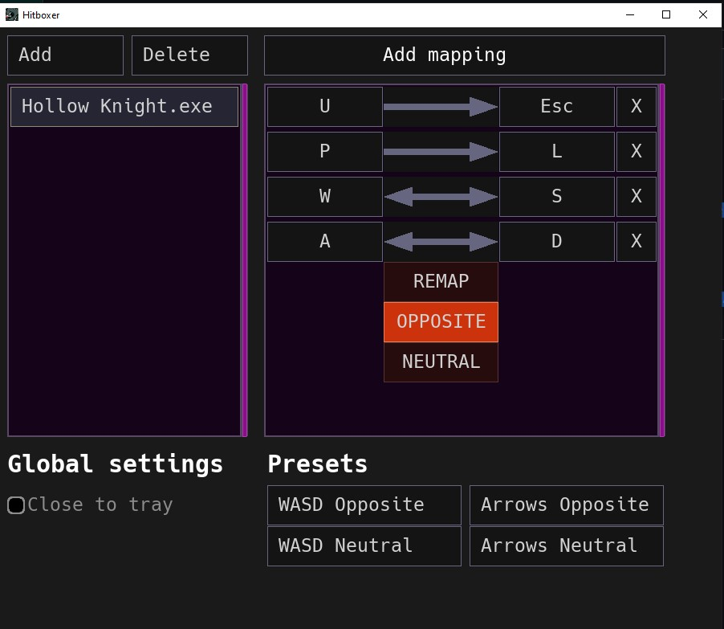

# Hitboxer, key remapper and SOCD tool for epic gamers

## NOTE
The program is in progress, there will be dragons. Still, please reach out to me or leave an issue on GitHub if something that you were using suddenly breaks.

## Install

1) Grab the latest version for your OS from [Releases page](https://github.com/valignatev/hitboxer/releases).

2) Unpack to any directory you have write access too (so no C\\:Program Files lol)

3) Run hitboxer.exe

It'll create a log file and a settings file. You're never expected to edit settings.socd by hand, it is here for your convenience in case you want to share config between computers

## Why do I need it and wtf is SOCD?

SOCD stands for simultaneous opposite cardinal direction. Basically, what'll
happen if you press "left" and "right" at the same time or "left" while holding "right", and vise versa.
Every game handles it differently. Some set such cases to "neutral", some have "last win", and
some games just don't know what to do and do whatever.

Devices like smashbox usually have settings that you can toggle to have the behavior you
want. This program basically allows you to do the same but with your keyboard.
(WIP, for now the only option is "last wins").

Use it at your own caution, especially if you do competitive gaming because
some communities require to use something particular and ban any other alternatives.
There you go, I warned you. Enjoy!

## Features

Profiles - every profile is a program for which Hitboxer is active. Click "Add", select currently running program (or type its .exe name in the input box and press enter)

Mappings - Add keyboard mappings that will be active for this program. For now, we only support mapping keyboard keys to other keyboard keys, but there is a plan to support mouse and controllers.

Mappings can be of 3 flavors - OPPOSITE (the last one you pressed wins, good for frame-perfect turnarounds and strafes), NEUTRAL (both keys cancel each other out), and REMAP (the basic mapping, you press key on the left, and key on the right comes out instead).

Presets for WASD and Arrows

An ability to close the window to tray (highly requested!)

## Windows version, permissions and antiviruses

Yep, functionality of this program is similar to those evil keyloggers that steal your passwords, so antiviruses might not like it. Well, this is a matter of you trusting me, as for any program that you download and run from the Internet. Also, for some people and some games it only works when run as admin, so try that if it doesn't work otherwise.

## Linux support

Almost done, but I need to polish it a bit more before I can comfortably release it!

## Compiling from source code

Hitboxer is written in Jai, so in order to compile it you will need access to Jai compiler, which is at the time of writing is in closed beta.

But if you happen to be in Jai beta, building is as simple as doing `jai build.jai` for debug build, and `jai build.jai - release` for release build.

## LICENSE

Hitboxer is licensed under MIT, Hack fonts that are used in its UI have its own license (pretty libre though), see `data` directory.
